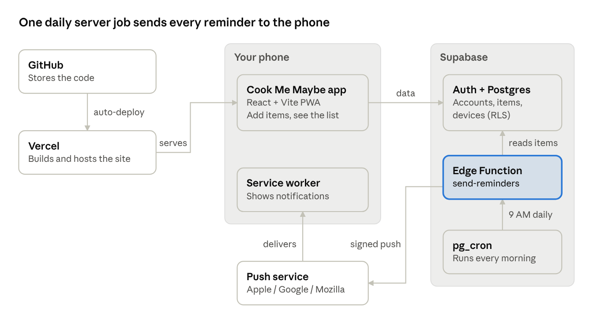

# 🥬 Cook Me Maybe: A Zero-Cost PWA That Reminds You to Cook Vegetables Before They Spoil



_Log what goes into the fridge. Get nudged every morning before it goes bad. Waste nothing._

🔗 **Live demo:** [cook-me-maybe.vercel.app](https://cook-me-maybe.vercel.app/)

📱 **New here?** Follow the illustrated [Add to Home Screen guide (PDF)](docs/Add-to-Home-Screen-Guide.pdf) to install the app and turn on reminders.

---

## 🧩 Overview

**Cook Me Maybe** is an installable web app (PWA) for tracking fresh produce and its expiry dates. You add an item, like lady's finger, and the date it goes bad. Starting 4 days before that date, your phone gets a push notification every morning until you mark the item **Cooked**.

The whole stack runs on free tiers: React on Vercel, Supabase for auth, data and scheduled jobs, and the Web Push standard for notifications.

---

## 🎯 The Problem

> Vegetables get bought with good intentions, pushed to the back of the fridge, and forgotten until they're thrown away.

There's no reminder in the fridge itself. By the time you notice, it's too late.

---

## 🧬 Core Idea

Turn every expiry date into a **daily countdown that comes to you**, instead of a list you have to remember to check.

- One notification per morning lists everything due soon, so there's no spam.
- Reminders repeat daily inside a 4-day window, so a missed nudge isn't the last one.
- One tap on **Cooked** ends the reminders for that item.

---

## 🧰 Tools and Technologies

| Category       | Stack                                                       |
| -------------- | ----------------------------------------------------------- |
| Frontend       | React 19, Vite, Progressive Web App (manifest + service worker) |
| Auth & Data    | Supabase Auth, PostgreSQL, Row-Level Security                |
| Server Logic   | Supabase Edge Functions (Deno, TypeScript), `web-push`       |
| Scheduling     | `pg_cron` + `pg_net` inside Postgres                          |
| Notifications  | Web Push API with VAPID keys                                  |
| Hosting & CI   | GitHub → Vercel (auto-deploy on push)                         |
| Cost           | **$0/month** (all free tiers)                                 |

---

## 🧩 How It Works

### Phase 1. Log an Item
The React app saves the item's name and expiry date to the `items` table. Quick-pick chips (Lady's finger, Spinach, Tomato, Carrot and more) pre-fill a typical shelf life.

### Phase 2. Register the Device
Tapping **Turn on** asks for notification permission, registers the service worker, and stores the browser's push subscription in `push_subscriptions`.

### Phase 3. Daily Trigger
Every morning, `pg_cron` makes an HTTP call through `pg_net` to the `send-reminders` Edge Function, authenticated with a shared secret.

### Phase 4. Find What's Due
The function finds uncooked items expiring between today and 4 days out, using the user's local time zone, and groups them per user.

### Phase 5. Push the Reminder
The function sends one signed, encrypted Web Push message per device. The service worker shows it even when the app is closed. Expired subscriptions (HTTP 404/410) are cleaned up automatically.

---

## 🗄️ Data Model

| Table                | Key Columns                                            | Purpose                             |
| -------------------- | ------------------------------------------------------ | ----------------------------------- |
| `items`              | `user_id`, `name`, `expiry_date`, `cooked`             | One row per item in the fridge      |
| `push_subscriptions` | `user_id`, `endpoint`, `p256dh`, `auth`                | One row per device to notify        |

Both tables enforce **Row-Level Security**: `auth.uid() = user_id`, so each user only ever sees their own rows.

---

## 🧠 Architectural Decisions & Tradeoffs

| Decision | Why | Tradeoff |
| --- | --- | --- |
| PWA instead of a native app | Free, one codebase for iPhone, Android and desktop, instant updates | iPhone push only works once the app is added to the home screen |
| Supabase as the whole backend | Auth, database, functions and cron in one free service; no custom server | Free projects can pause after about a week of inactivity |
| Browser talks to the database directly | No API layer to build or host | Security depends on RLS policies being correct |
| `pg_cron` for scheduling | Lives next to the data, no external scheduler needed | The schedule is in UTC, so reminders shift an hour with daylight saving |
| One grouped notification per day | Respects attention; no notification spam | Less granular than per-item alerts |

---

## ⚠️ Limitations & Future Directions

- Expiry dates are entered by hand, and quick-pick shelf lives are typical estimates.
- No editing of an item's date yet; remove and re-add instead.
- **Next:** per-user reminder time, barcode or receipt scanning, recipe ideas from what's expiring, a shared household fridge, and a food-saved vs wasted stats view.

---

## 📱 Install on Your Phone

1. Open [cook-me-maybe.vercel.app](https://cook-me-maybe.vercel.app/) in Safari (iPhone) or Chrome (Android)
2. Add it to your home screen:
   - **iPhone:** menu button → **Share** → **Add to Home Screen** → **Add**
   - **Android:** three-dot menu → **Install and create shortcut** → **Install**
3. Open the app from the home-screen icon, sign up, and turn on notifications from the menu

Step-by-step screenshots for iPhone and Android: **[Add to Home Screen guide (PDF)](docs/Add-to-Home-Screen-Guide.pdf)**

---

## 🚀 Getting Started

```bash
npm install
cp .env.example .env   # add your Supabase URL, publishable key, VAPID public key
npm run dev
```

Full step-by-step deployment (Supabase, Edge Function, schedule, Vercel) is in **[SETUP.md](SETUP.md)**.

---

## 👩‍💻 Author

**Naga Hema Ramishetty**
Data Analyst
**GitHub:** [github.com/nagahemaramishetty](https://github.com/nagahemaramishetty)

## 🧭 Keywords

`React` · `Vite` · `PWA` · `Supabase` · `PostgreSQL` · `Row-Level-Security` · `Edge-Functions` · `pg_cron` · `Web-Push` · `Vercel` · `Serverless` · `Food-Waste` · `Full-Stack`

---

_A reminder you'll actually see beats a fridge you'll never check._
_Built end to end on free infrastructure, from database to push notification._
